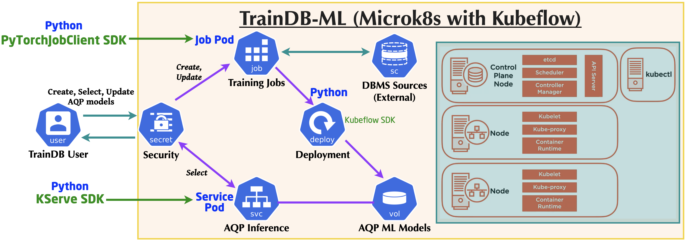

# KServe SDK Testing

## References

* [KServe Python SDK](https://kserve.github.io/website/0.8/sdk_docs/sdk_doc/)
* [KServe Features and Examples](https://github.com/kserve/kserve/tree/master/docs/samples)

---
* Sung-Soo Kim
* Updated: 11 July, 2022.

This is a sample for KServe SDK v1beta1. 

###  Installation
KServe Python SDK can be installed by pip or Setuptools.


#### pip install

```sh
pip install kserve
```

## KServe Python Server
KServe's python server libraries implement a standardized library that is extended by model serving frameworks such as Scikit Learn, XGBoost and PyTorch. It encapsulates data plane API definitions and storage retrieval for models.

It provides many functionalities, including among others:

* Registering a model and starting the server
* Prediction Handler
* Pre/Post Processing Handler
* Liveness Handler
* Readiness Handlers

## KServe Client

### Getting Started
KServe's python client interacts with KServe control plane APIs for executing operations on a remote KServe cluster, such as creating, patching and deleting of a InferenceService instance. See the Sample for Python SDK Client to get started.

Refer to details in KServe client API as the following link.
* [Documentation for Client API](https://kserve.github.io/website/0.8/sdk_docs/sdk_doc/)

## TrainDB-ML Architecture Overview

This diagram shows the architecture for TrainDB-ML implementation in terms of service architecture.

